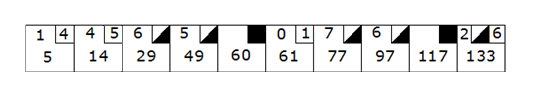

# Bowling Game Score Calculator

### Overview
You are tasked with building a Bowling Score Calculator to calculate the score of a player based on the standard rules of bowling. The game consists of 10 frames, and the player has two opportunities to knock down 10 pins in each frame, except for the 10th frame, where extra rolls are allowed for strikes and spares.

### Scoring Rules



#### Basic Scoring:

- Each frame consists of two rolls, unless a strike occurs.
- A strike occurs when all 10 pins are knocked down on the first roll of a frame.
- A spare occurs when the player knocks down all 10 pins in two rolls of the frame.
- The score for each frame is calculated by adding:
  - The number of pins knocked down in that frame.
  - **Bonus for Spares:** The number of pins knocked down in the next roll after a spare.
  - **Bonus for Strikes:** The total number of pins knocked down in the next two rolls after a strike.

#### Tenth Frame:

- If a player rolls a strike or spare in the 10th frame, they are allowed to roll an additional ball (up to 3 total rolls for the frame).
- The additional roll(s) are used solely to determine the bonus for the strike or spare in the 10th frame.

### Test-Driven Development (TDD) Setup
- The code is being developed with TDD, and tests are defined under:
`./main/test/java/BowlingGameTest.java`
- The goal is to implement the BowlingGame class and associated logic so that the tests pass.

### Examples

#### Example 1: A Simple Game with No Strikes or Spares
```text
Rolls: 2, 3 | 4, 5 | 6, 2 | 3, 6 | 1, 4 | 6, 2 | 5, 4 | 7, 0 | 6, 3 | 8, 1

Score:    5 |   14 |   22 |   31 |   36 |   44 |   53 |   60 |   69 |   78
```

#### Example 2: A Game with Spares
```text
Rolls: 5, 5 | 3, 6 | 2, 7 | 0, 8 | 9, 1 | 4, 6 | 7, 2 | 6, 3 | 5, 5 | 2, 8, 5

Score:   13 |   22 |   31 |   39 |   53 |   70 |   79 |   88 |  100 |     115
```

#### Example 3: A Game with Strikes and Spares
```text
Rolls: 10 | 6, 4 | 2, 6 | 7, 3 | 10 | 1, 6 | 4, 4 | 2, 5 | 3, 6 | 10, 0, 4
Score: 20 |   32 |   40 |   60 | 76 |   83 |   91 |   98 |  107 |      121
```

#### Example 4: A Perfect Game (All Strikes)
```text
Rolls: 10 | 10 | 10 |  10 |  10 |  10 |  10 |  10 |  10 | 10, 10, 10
Score: 30 | 60 | 90 | 120 | 150 | 180 | 210 | 240 | 270 |        300
```